<div align="center">


# JobPilot

### Tailored, fact-checked CVs and cover letters — generated by a local LLM, never invented.

Paste a job offer. JobPilot finds the evidence for every requirement in your real profile, writes a
CV and motivation letter grounded in it, fact-checks every sentence, and compiles ATS-friendly PDFs
with LaTeX. Everything runs on your machine.


[Features](#-features) · [Screenshots](#-screenshots) · [Use cases](#-use-cases) ·
[Architecture](#-architecture) · [Tech stack](#-tech-stack) · [Getting started](#-getting-started) ·
[Roadmap](#-roadmap)

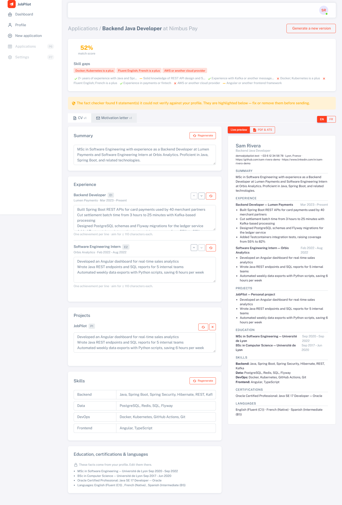

</div>

---

## ✨ Why JobPilot?

Applying for jobs means rewriting the same CV and letter for every offer. Generic AI writers are
fast, but they **invent experience you don't have**, which is the one thing you can't afford in an
interview.

JobPilot is built on a simple rule: **the model may rephrase your experience, never create it.**

| | Generic AI writer | JobPilot |
|---|---|---|
| Source of facts | Whatever the model "knows" | Your structured master profile only |
| Employers, titles, dates | Generated (can be wrong) | Copied from your profile by reference |
| Unverifiable claims | Silently included | Flagged by a deterministic fact checker |
| Output | Plain text | ATS-checked PDFs (LaTeX) + editable JSON |
| Privacy | Your CV goes to a cloud API | 100 % local (Ollama), self-hostable |

## 🚀 Features

- **📄 CV import.** Upload a PDF or DOCX. Text is extracted with Tika, PDFBox and POI, and Llama
  turns it into a structured, editable master profile.
- **🔍 Job analysis.** Paste an offer as text or HTML. JobPilot extracts the title, seniority,
  must-haves, nice-to-haves, keywords and tone. HTML and prompt-injection lines are removed first.
- **🧠 RAG evidence.** Your profile is chunked and embedded into **pgvector**. Each requirement is
  matched to your evidence with hybrid search (vector similarity plus term overlap).
- **🎯 Match score and skill gaps.** A 0–100 score with a verdict per requirement (must-haves count
  double), so you know where you stand before applying.
- **✍️ Grounded generation.** The CV and letter are written from an *evidence pack* of references
  (`E1`, `P1`, `S1` …). The model writes the wording; your facts are copied in by reference.
- **🛡️ Fact checker.** Numbers, technologies, organisations, skills and the document's language are
  checked against your profile. The model gets one corrective retry, and anything still unverified
  is highlighted for you to fix.
- **🖊️ Editor.** Edit the summary, bullets, skills and letter paragraphs; regenerate a single
  section; see a live preview. Facts stay locked to your profile.
- **🌍 FR ⇄ EN in one click.** Translate a CV or letter into a new version. Names, employers,
  dates and skills are never sent for translation.
- **🖨️ LaTeX PDFs.** Compiled in a **sandboxed worker** with Tectonic, with a template picker and
  options (font size, accent colour, spacing, section order).
- **✅ ATS self-check.** Each PDF is scored on four checks: a real text layer, standard headings,
  readable contact details and page count.

## 📸 Screenshots

<table>
  <tr>
    <td width="50%">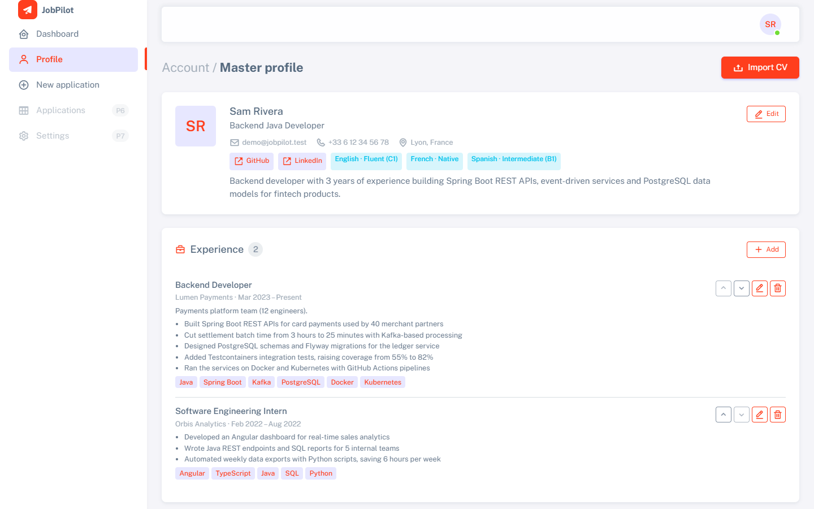</td>
    <td width="50%">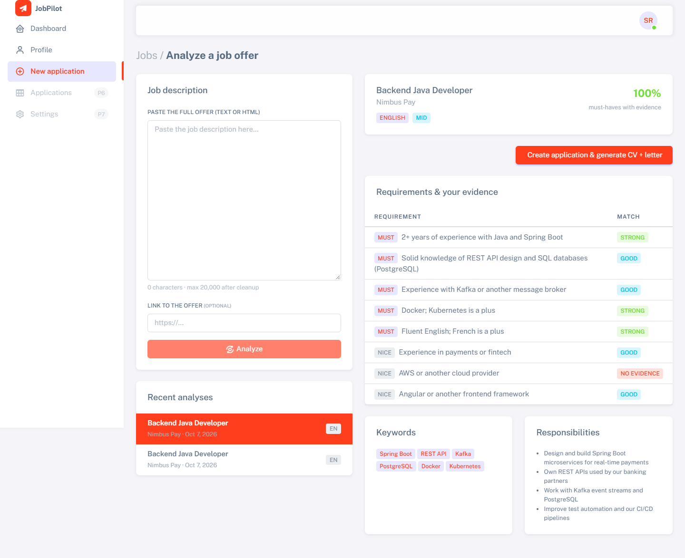</td>
  </tr>
  <tr>
    <td align="center"><b>Master profile</b>: imported from your CV, fully editable</td>
    <td align="center"><b>Job analysis</b>: requirements, keywords and evidence strength from your profile</td>
  </tr>
  <tr>
    <td>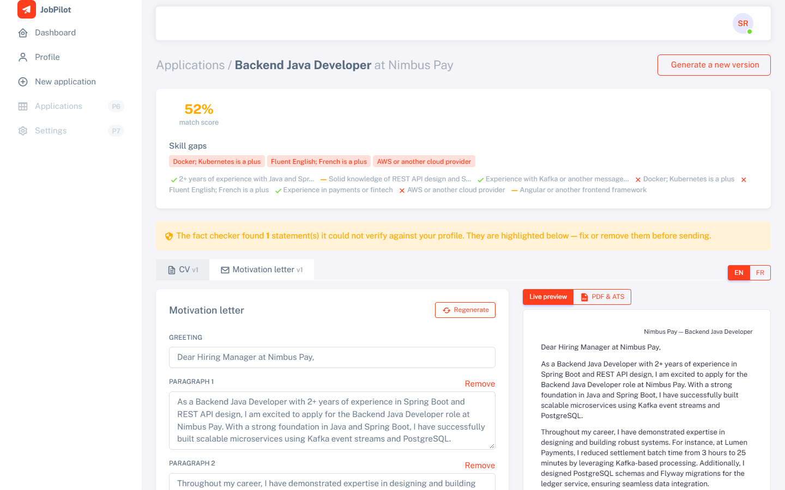</td>
    <td>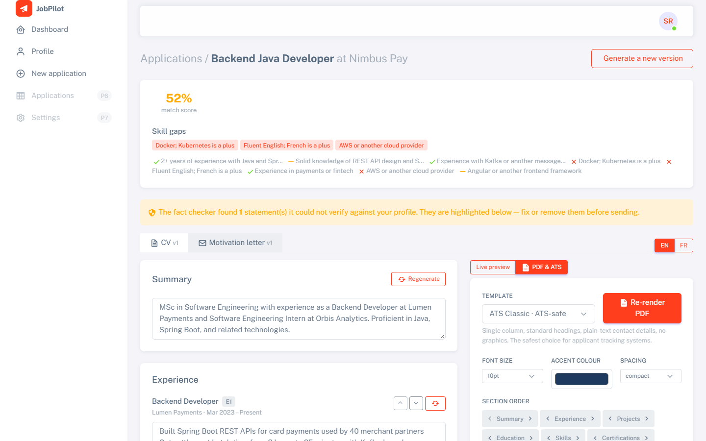</td>
  </tr>
  <tr>
    <td align="center"><b>Motivation letter</b>: paragraph editor with live preview</td>
    <td align="center"><b>PDF &amp; ATS</b>: template options, LaTeX render and ATS score</td>
  </tr>
  <tr>
    <td>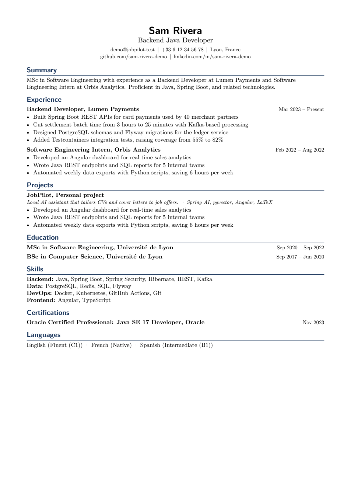</td>
    <td>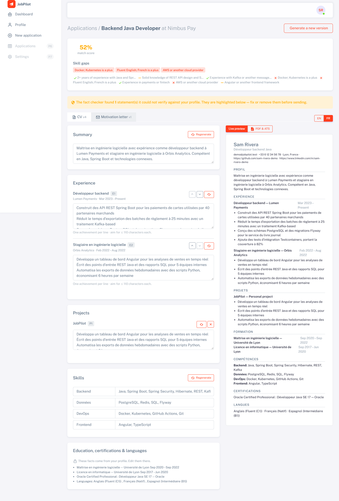</td>
  </tr>
  <tr>
    <td align="center"><b>Generated PDF</b>: single-column <code>ats-classic</code> template, ATS score 100</td>
    <td align="center"><b>FR ⇄ EN toggle</b>: the same CV as a French version</td>
  </tr>
  <tr>
    <td>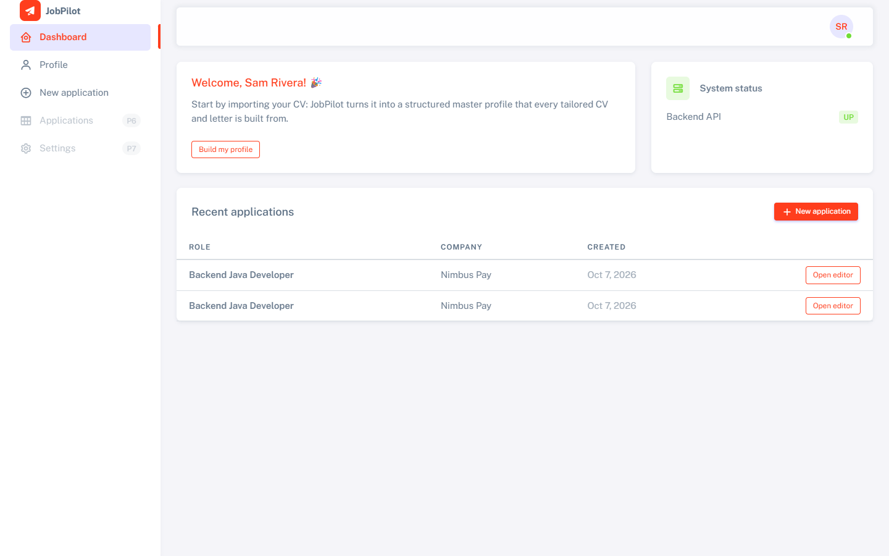</td>
    <td>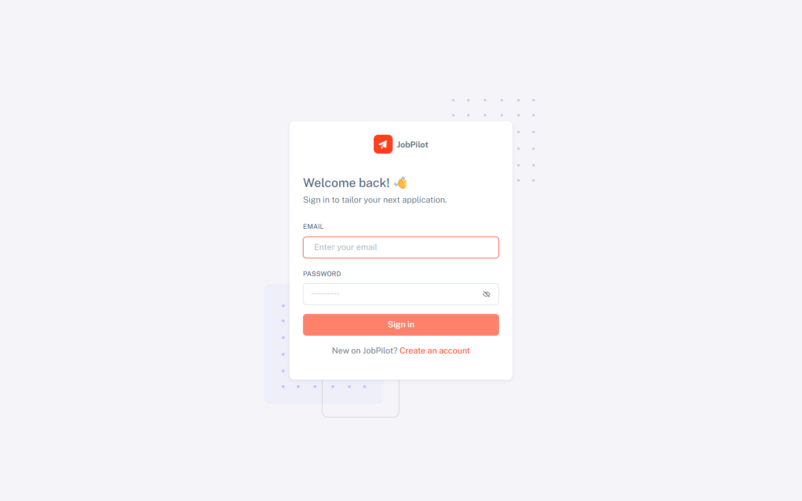</td>
  </tr>
  <tr>
    <td align="center"><b>Dashboard</b>: recent applications</td>
    <td align="center"><b>Sign in</b>: JWT auth with rotating refresh tokens</td>
  </tr>
</table>

> The screenshots use a **fictional demo profile** ("Sam Rivera") and real output from the local
> models. You can recreate them with [`scripts/demo/seed_demo.py`](scripts/demo/seed_demo.py).

## 💼 Use cases

| Who | Situation | How JobPilot helps |
|---|---|---|
| **Junior developer** applying to 30+ offers | Every offer needs a different emphasis | One profile, a tailored CV and letter per offer in a few minutes, with the right keywords and no invented skills |
| **Bilingual candidate** (France, Belgium, Canada, Maghreb…) | Some offers are in French, some in English | The document language follows the offer, and one click switches FR ⇄ EN |
| **Career changer** | Unsure whether they qualify | The match score and per-requirement evidence show exactly what is missing before applying |
| **Privacy-conscious job seeker** | Doesn't want their CV in a cloud LLM | Everything runs locally with Ollama: no API keys, no data leaves the machine |
| **ATS-heavy hiring pipelines** | Fancy CVs get parsed badly | LaTeX templates designed for ATS, plus a self-check on the real PDF |
| **Student / portfolio** | Wants to show full-stack and applied-AI skills | A production-style codebase: RAG, guarded LLM output, sandboxing, tests, CI |

### Typical flow

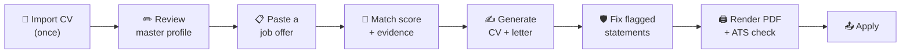

## 🏗️ Architecture

### System overview

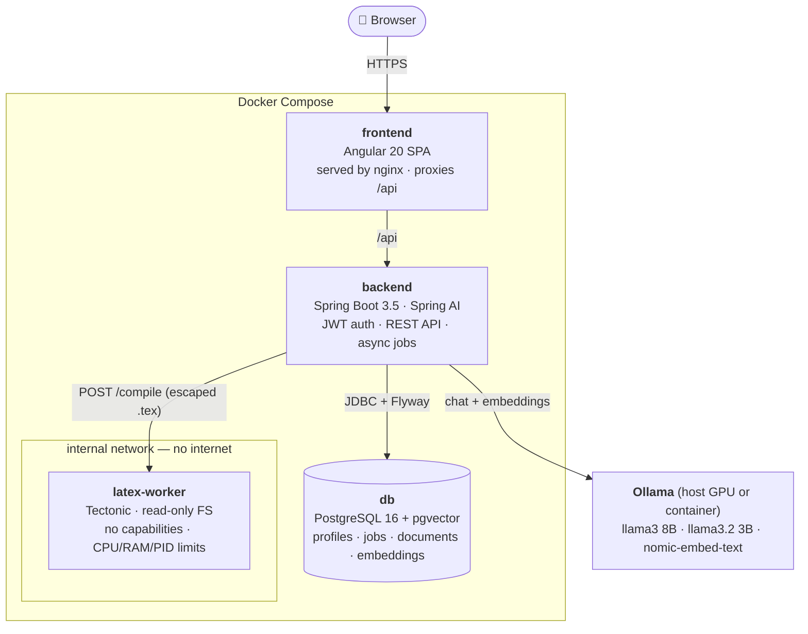

### Generation pipeline

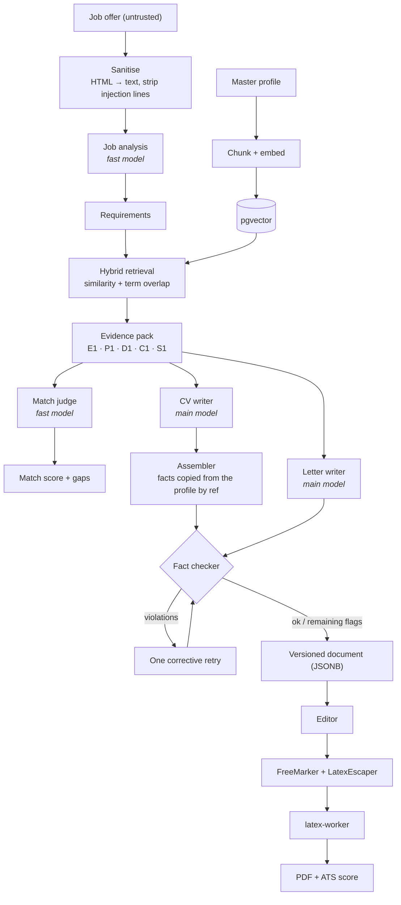

### How hallucinations are prevented

1. **Facts by reference.** The model only returns refs like `E1` plus its wording. Employers,
   titles, dates, education, certifications and languages are copied from the profile by the
   `ContentAssembler`, so they can't be invented.
2. **Skills whitelist.** A skill that isn't in the profile is dropped. Skills the model forgot are
   added back.
3. **Deterministic fact checker.** It flags every number not in the profile, every technology taken
   from the job ad that isn't in the profile, every unknown organisation after "at / for / chez…",
   and text in the wrong language. Golden-file tests cover it.
4. **Retry, then flag.** Violations go back to the model once. What remains is shown to you,
   highlighted, before you send anything.

### Security by design

| Threat | Mitigation |
|---|---|
| Prompt injection in job offers | The offer is passed as delimited **data**. Delimiters are stripped from content, and suspicious lines are removed before analysis |
| LaTeX injection / file reads | Every string goes through `LatexEscaper` (FreeMarker auto-escaping). The worker rejects file I/O primitives and runs with **no shell-escape** |
| Compromised compiler | `latex-worker` sits on an internal network (no internet) with a read-only filesystem, tmpfs, `cap_drop: ALL`, `no-new-privileges` and CPU/memory/PID limits |
| XSS from model output | Model text is always interpolated by Angular, **never** bound as HTML |
| Stolen tokens | 15-minute JWT access tokens. Refresh tokens are hashed, rotated, and a reused token revokes the session |
| Secrets in git | All secrets come from `.env`, which is git-ignored |

### Data model (simplified)

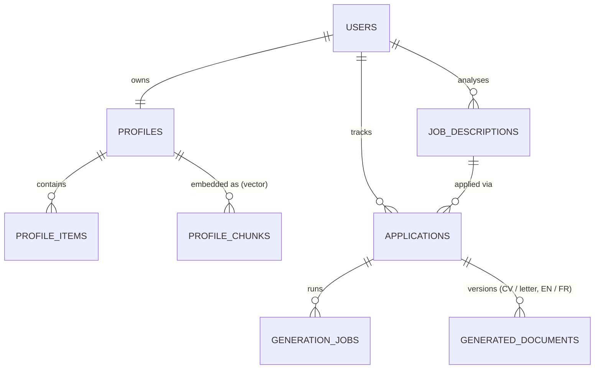

## 🧰 Tech stack

| Layer | Technologies |
|---|---|
| **Backend** | Java 17, Spring Boot 3.5, Spring Security (stateless JWT, jjwt), Spring Data JPA / Hibernate, Flyway, Bean Validation, Maven |
| **AI / RAG** | Spring AI 1.0, Ollama: `llama3` 8B (writing), `llama3.2:3b` (fast tasks + memory fallback), `nomic-embed-text` (embeddings); pgvector HNSW, hybrid retrieval |
| **Documents** | Apache Tika, PDFBox and Apache POI (import); FreeMarker + custom LaTeX output format; Tectonic (XeTeX); PDFBox (ATS check) |
| **Frontend** | Angular 20 (standalone components, signals, functional guards/interceptors), Sneat admin UI, nginx |
| **Database** | PostgreSQL 16, pgvector, JSONB documents, partial unique indexes, advisory locks |
| **Infra** | Docker Compose (5 services, sandboxed worker), BuildKit cache mounts, GitHub Actions CI |
| **Quality** | JUnit 5, Mockito, Testcontainers (pgvector + latex-worker), golden-file tests, Karma/Jasmine |

**Measured on a laptop with a 4 GB VRAM GPU** (native Ollama, demo profile):

| Step | Model | Time |
|---|---|---|
| Job analysis | llama3.2 3B | 33–60 s |
| Full generation (evidence → match → CV → letter) | 3B + 8B | 3–6 min |
| CV import (PDF → structured profile) | llama3 8B | ~2 min |
| PDF render + ATS check | — | a few seconds |
| FR ⇄ EN translation of a full CV | llama3 8B | ~8 min |

## 🏁 Getting started

### Prerequisites
- **Docker Desktop**
- **Ollama**: either native (recommended, uses your GPU) or the bundled container
- About **8 GB of free RAM** for the 8B model; a fallback to the 3B model kicks in automatically
  when memory is short

### 1. Configure

```bash
cp .env.example .env
```

Fill in `DB_PASSWORD`, `JWT_SECRET` (32+ characters) and `ENCRYPTION_KEY` with random values.

### 2. Get the models (native Ollama)

```bash
ollama pull llama3 && ollama pull llama3.2:3b && ollama pull nomic-embed-text
```

In `.env`, remove `COMPOSE_PROFILES` and set `OLLAMA_BASE_URL=http://host.docker.internal:11434`.
To run Ollama inside Docker instead, keep `COMPOSE_PROFILES=docker-ollama` and the models are
pulled on first start.

### 3. Run

```bash
docker compose up -d --build
```

Open **http://localhost:4200**, create an account, import your CV and paste a job offer.

### 4. (Optional) Load the demo data

```bash
python -X utf8 scripts/demo/seed_demo.py
```

This creates the fictional "Sam Rivera" account (credentials are in the script), a profile and a
job offer, then runs a real generation.

### Configuration

| Variable | Purpose | Default |
|---|---|---|
| `OLLAMA_BASE_URL` | Ollama endpoint | `http://ollama:11434` |
| `OLLAMA_CHAT_MODEL` | Main writing model | `llama3.1:8b` |
| `OLLAMA_FAST_MODEL` | Job analysis + match judgment | *(main model)* |
| `OLLAMA_FALLBACK_MODEL` | Used when the main model doesn't fit in memory | *(none)* |
| `OLLAMA_EMBEDDING_MODEL` | Embeddings | `nomic-embed-text` |

## 🔌 API overview

| Method | Endpoint | Description |
|---|---|---|
| `POST` | `/api/auth/register` · `/login` · `/refresh` · `/logout` | Authentication |
| `GET` `PUT` | `/api/profile` | Master profile |
| `POST` | `/api/profile/import` | Upload a CV (PDF/DOCX) → structured profile |
| `POST` `PUT` `DELETE` | `/api/profile/items[/{id}]` | Profile items (experience, projects, skills…) |
| `POST` | `/api/jobs/analyze` | Analyse a job offer |
| `GET` | `/api/jobs/{id}/evidence` | Evidence from the profile for each requirement |
| `POST` | `/api/applications` | Create an application from an analysed offer |
| `POST` | `/api/applications/{id}/generate` | Start async generation (poll `/api/generation-jobs/{id}`) |
| `GET` `PUT` | `/api/documents/{id}` | Read / edit a generated document |
| `POST` | `/api/documents/{id}/regenerate-section` | Regenerate one section |
| `POST` | `/api/documents/{id}/translate` | EN ⇄ FR into a new version |
| `POST` | `/api/documents/{id}/render` | Render a PDF with a template + run the ATS check |
| `GET` | `/api/documents/{id}/pdf` | Download the PDF |

The full design, including the planned endpoints, is in [docs/PROJECT.md](docs/PROJECT.md#26-rest-api).

## 🧪 Testing

```bash
cd backend && mvn -B verify
```

The backend runs 127 tests, including integration tests against real pgvector and latex-worker
containers. Docker is required.

```bash
cd frontend && npx ng test --watch=false --browsers=ChromeHeadless
```

The frontend has 26 specs.

- **LLM calls are mocked in tests.** No Ollama is needed, and the tests are deterministic.
- **Golden files** in `backend/src/test/resources/golden/validator/` pin down the fact checker's
  behaviour.
- **Security tests** check that the LaTeX worker rejects `\input{/etc/passwd}`-style attacks and
  that escaping holds for every special character.
- **CI** (GitHub Actions) builds and tests the backend, frontend and Docker images on every PR.

## 📁 Project structure

```
backend/          Spring Boot API
  └─ com.jobpilot   auth · profile · rag · job · application · generation · template · common
frontend/         Angular 20 app (Sneat UI), served by nginx
latex-worker/     Sandboxed Tectonic compiler (Python HTTP server, warmed-up package cache)
scripts/demo/     Demo data seeder used for the screenshots
docs/             PROJECT.md (design), DECISIONS.md (deviations), screenshots/
.github/          CI workflow
```

## 🗺️ Roadmap

- [x] **Foundation**: schema, JWT auth, Angular shell, Docker Compose
- [x] **Profile**: CV import, LLM structuring, profile editor
- [x] **RAG**: chunking, embeddings, hybrid retrieval, job analysis
- [x] **Generation**: async CV + letter, fact checker, match score, editor
- [x] **LaTeX PDF**: sandboxed worker, `ats-classic` template, ATS check, template picker
- [x] **Languages and speed**: FR ⇄ EN toggle, language checks, fast model for simple tasks
- [ ] **Tracker**: applications table + Kanban, filters, Excel export
- [ ] **Notion sync**: two-way sync with your job-tracking database
- [ ] **Email**: send the CV + letter with attachments, message log
- [ ] **Polish**: second template (`modern-compact`), statistics dashboard, deployment

### Known limitations

These are honest notes from testing with small local models:
- The 3B match judge sometimes marks soft requirements ("Fluent English", "Kubernetes is a plus")
  as gaps even when the profile covers them.
- The CV writer can occasionally reuse an experience's bullets for a project. Review it in the
  editor before sending.
- On a 4 GB GPU, translating a full CV takes several minutes; a bigger GPU makes everything much
  faster.

## 📄 License

[MIT](LICENSE) © 2026 Hadil Sghair
